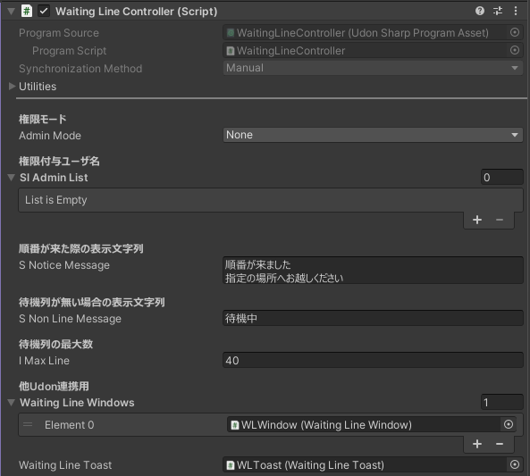
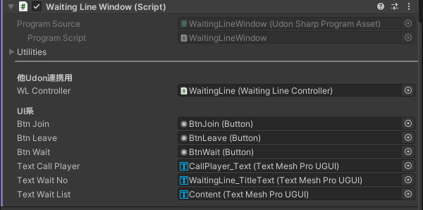
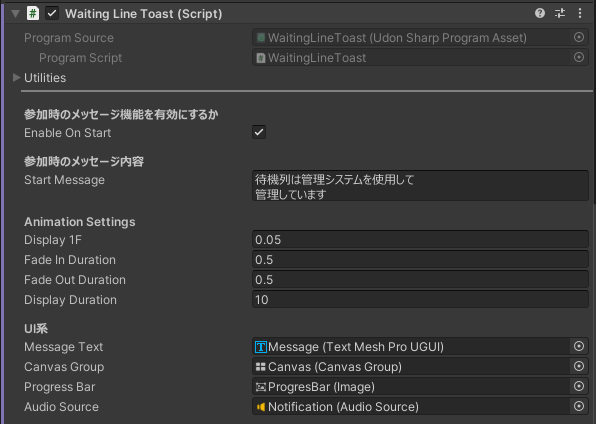

# 待機列管理システム
誕生日会場での2S列などの待機列を管理するシステムです．

基本的な機能としては以下
- 列に参加・退出
待機列への参加や退出ができます．
インスタンスを退出しても，順番が来るまでは列に並んでる状態になります．
- 待機列を進める（列の先頭の人を呼び出す）
単純に待機列の先頭の人を呼び出します．
インスタンスにいない場合は，列から除外して次の人を呼びます
- 呼び出し時の通知
順番が来た場合にメッセージと音で通知します．

## 使い方
1. Unitypackageをインポートします
2. Prefab「WaitingLineController」をシーン上に置いて，位置を調整します

### 複数Windowを使いたい場合
1. Prefab「WaitingLineWindow」をシーン上に置く，もしくはシーン上の「WaitingLineWindow」をコピペして，位置の調整します  
この時，Inspector内「WaitingLineWindow(Script)」内の「WaitingLineController」が設定されているか確認してください．  
設定されていなければ配置済みの「WaitingLineController」を設定してください．
2. シーン上の「WaitingLineController」内のUdonコンポーネントの設定を変更する
Inspector内「WaitingLineController(Script)」内の「WaitingLineWindows」に先ほど追加したWindowを追加してください

## 各種設定
### WaitingLineController

- 権限モード：AdminMode  
待機列を進める権限設定を変更します
    - None：全員に権限を付与します
    - InstanceOwner：インスタンスオーナのみに権限を付与します
    - InList：SLAdminListに設定したユーザに権限を付与します

- 権限付与ユーザ名：slAdminList  
権限モードが「InList」の場合に付与するユーザ名を設定します

- 順番が来た際の表示文字列：sNoticeMessage  
順番が来た際の通知内の文字列を設定します

- 待機列が無い場合の表示文字列：sNonLineMessage  
待機列に誰もいない際に待機列を進めた場合に表示する文字列を設定します

- 待機列の最大数：iMaxLine  
待機列の最大参加数を設定します  
待機列上限の場合は列に参加できなくなります

- 他Udon連携用  
    - WaitingLineWindows  
    使用するWaitingLineWindowを設定します
    - WaitingLineToast  
    使用するWaitingLineToastを設定します

### WaitingLineWindow

- 他Udon連携用：WaitingLineController  
使用しているWaitingLineControllerを設定します

- UI系  
    - BtnJoin  
    Joinボタン
    - BtnLeave
    Leaveボタン  
    - BtnWait  
    待機中ボタン
    - TextCallPlayer
    呼び出しユーザ表示  
    - TextWaitNo  
    待機順表示
    - TextWaitList
    待機列状態表示  

### WaitingLineToast

- 他Udon連携用：WaitingLineController  
使用しているWaitingLineControllerを設定します
- 他Udon連携用：WaitingLineController  
使用しているWaitingLineControllerを設定します

- 通知アニメーション設定  
通知を表示する際のアニメーションの設定
    - display1F  
    1Fにかける時間を設定
    - fadeInDuration  
    開始時の透明度変更時間を設定
    - fadeOutDuration  
    終了時の透明度変更時間をを設定
    - displayDuration  
    透明度変更時間を除いた表示時間を設定

- UI系  
    - messageText  
    メッセージ表示
    - canvasGroup
    透明度設定用  
    - progressBar  
    表示時間表示用
    - audioSource
    呼び出し時音声